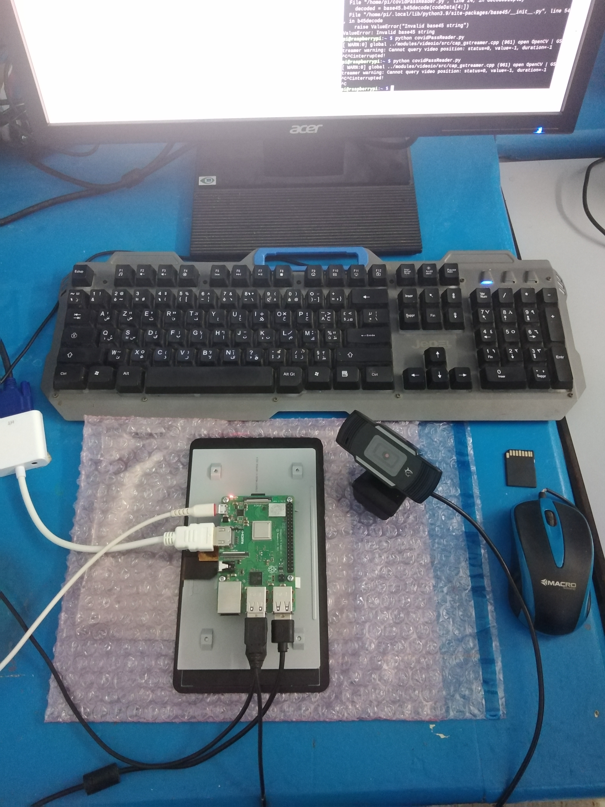
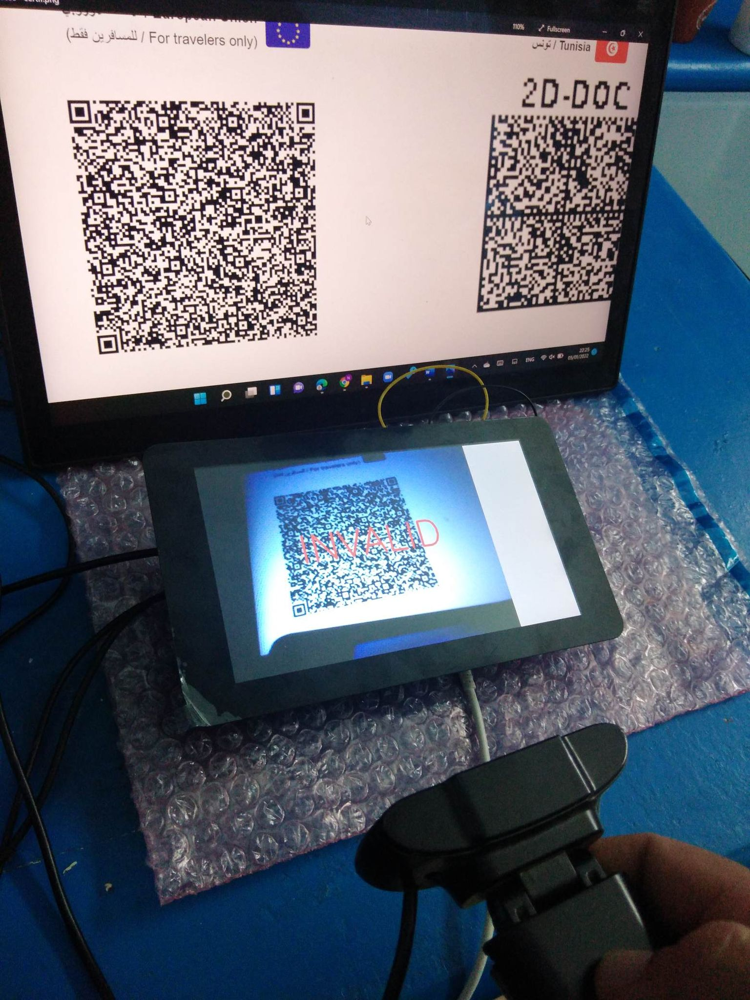
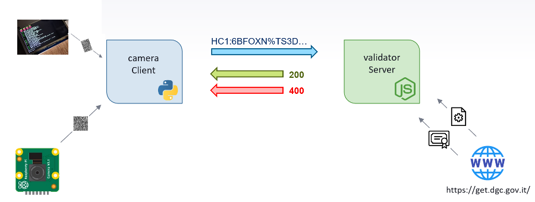

# Raspberry covid19 green pass verification

    
    

A camera client written in Python detects, decodes and decrypt QR codes and sends them to the validation server, written in Node.js.

The validation server does formal verification including
verifying the signature and the business rules.

Result (pass informations / 'invalid') is displayed on the screen.

